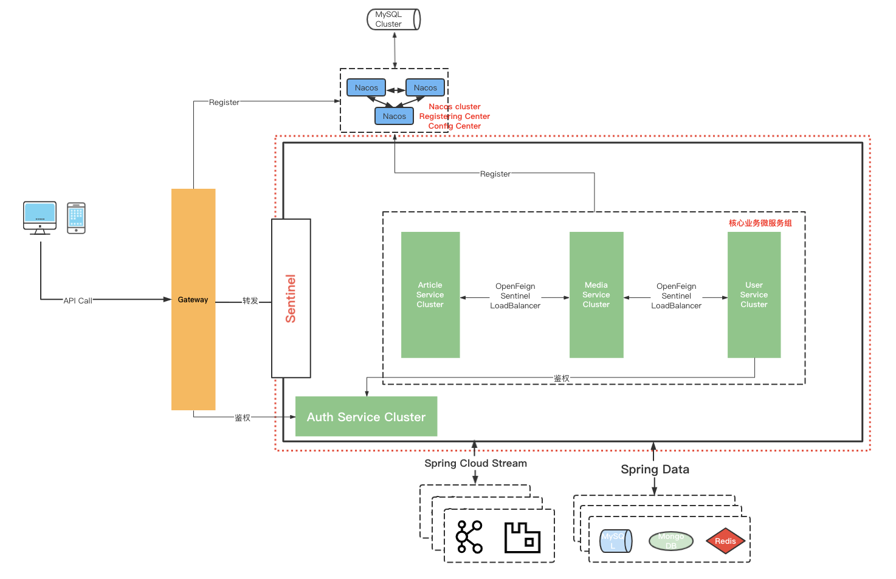
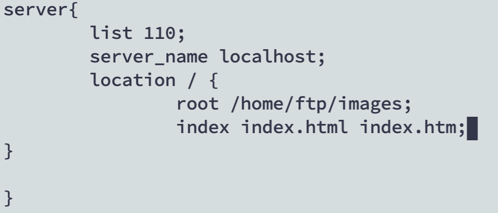

# hs-bolg-microservice
**一个简单易上手的微服务博客项目，SpringCloud + Alibaba，旨在以透彻的方式阐述微服务的设计理念！**

该项目是一个功能较为朴实的微服务博客项目，这个项目适用于正在入门微服务以及正在转型做后端开发的同学们。本项目会让你有很大的信心把它看完，并且自己动手添加或者是修改里面的一些功能，及其适合相关领域的初学者。因为自己这一路走过来，最大的感触就是——万事开头难！其实后端开发的难度或许并没有那么大，造成难度大的是自己的步子迈得太大。

不久之前，作者在学习的过程中也是找了很多项目，但是代码功能普遍没有注释，可谓极其晦涩，一时间甚至略损信心。对于后端研发来说（其实是通用的），对于技术的探索就好比是一条无尽的旅途，虽然无尽，但相对平坦。但在平坦之前有一条湍急的河流，要想真正踏实追求技术的征途得先摸着石头过这条河，这就是”理论与实践的差距之河“。

愿众君能摸着本项目过河！感觉有帮助的可以Star一波～

### 项目结构

---


|   Module Name    |                      Desc                       |
| :--------------: | :---------------------------------------------: |
| hs-blog-article  |    文章服务，提供博客文章主体和分类相关数据     |
|   hs-blog-auth   | OAuth2鉴权服务，提供token的签发、校验和刷新服务 |
|  hs-blog-common  |                     公共类                      |
| hs-blog-gateway  |             网关服务，提供路由转发              |
| hs-blog-message  |                  消息队列服务                   |
| hs-blog-sentinel |                Alibaba Sentinel                 |
|   hs-blog-user   |             用户服务，提供用户数据              |
|  hs-blog-media   |                   图片服务器                    |
|  hs-blog-seata   |                   分布式事务                    |



### 技术栈

----


|            技术选型             |       Desc        |
| :-----------------------------: | :---------------: |
|          Mybatis-Plus           |         -         |
|           SpringBoot            |      脚手架       |
|              Mysql              |         -         |
|              Redis              |         -         |
|              Nginx              |  图片服务器载体   |
|            RabbitMQ             |         -         |
|              Maven              |         -         |
|     Spring Security Oauth2      |       鉴权        |
|      Spring Cloud Gateway       |       网关        |
|     Spring Cloud OpenFeign      |     远程调用      |
|       Spring Cloud Stream       |   统一消息服务    |
|  Spring Cloud Alibaba - Nacos   | 配置中心/注册中心 |
| Spring Cloud Alibaba - Sentinel |     服务监控      |
|                                 |                   |


### 项目启动

----

**--- >首先启动Nacos**

微服务项目其他服务启动顺序无所谓，但是注册中心为避免不必要的麻烦最好第一个启动。Nacos作为配置中心建议使用MySQL做持久化，避免开关机等操作至使频繁重新做配置。

[Nacos下载安装和启动](https://nacos.io/zh-cn/docs/quick-start.html)

Nacos持久化到MySQL配置：

1. 在nacos安装的目录中把schema.sql搞到mysql里头，建立对应的nacos_config数据库
1. 修改nacos安装的目录下的conf/application.properties文件，添加mysql数据源的url、用户名和密码

```properties
spring.datasource.platform=mysql

db.num=1
db.url.0=jdbc:mysql://serverIp:3306/nacos_config?characterEncoding=utf8&connectTimeout=1000&socketTimeout=3000&autoReconnect=true
db.user=root
db.password=123456
```

**--- >Sentinel启动和规则配置（可选）**


本地下载Sentinel控制台的JAR包后运行，本项目的Sentinel配置采用控制台界面配置的方式来进行。具体配置略，抽象讲就是对某个/些具体的接口进行流量监控，并配置限流、熔断的规则。


**--- >图片服务器Media Service的基础设施搭建（可选）**

该项目的图片服务器采用自建的方式，当然也可以用商业性质的，来得更快。

图片服务器采用的技术组合是nginx（图片获取）和vsftp（图片上传）。vsftpd的全称是very secured FTP daemon，就是很安全的FTP。

相关的技术组合很多，比如nginx + FastDFS也是个不错的选择，FastDFS是一个开源的轻量级分布式文件系统，对于大量的图片存储以及视频业务性能体验较好。

1. vsftpd的下载和配置，下面有个最靠谱的文章，是英文版的，我把核心命令行摘抄出来

   https://www.howtoforge.com/tutorial/how-to-install-and-configure-vsftpd/

   https://help.ubuntu.com/community/vsftpd

   ```bash
   # 下载
   sudo apt-get install vsftpd
   # cd到etc下去做一些配置
   sudo nano /etc/vsftpd.conf
   # 在vsftpd.conf中
   # 禁止匿名访问
   anonymous_enable=NO
   # 允许本地用户读写
   local_enable=YES
   write_enable=YES
   # 创建并修改被拒绝用户用户列表
   userlist_deny=YES
   userlist_file=/etc/vsftpd.denied_users
   # 创建并修改被允许用户用户列表
   userlist_deny=NO
   userlist_enable=YES
   userlist_file=/etc/vsftpd.allowed_users
   # 新建用户，之后把该用户名添加到vsftpd.allowed_users即可生效
   useradd ftpuser
   passwd ftpuser
   
   # .properties中ftp的配置文件说明
   #配置文件上传器
   spring.servlet.multipart.max-file-size=100MB
   spring.servlet.multipart.max-request-size=100MB
   #ftp相关配置
   #服务器地址
   FTP.ADDRESS=your ip
   #FTP服务端口,默认是21
   FTP.PORT=21
   #访问FTP服务的用户名
   FTP.USERNAME=ftpuser
   #访问FTP服务的用户名对应的密码
   FTP.PASSWORD=ftpuser
   #图片存放在服务器指定的文件夹
   FTP.BASEPATH=/home/ftpuser/images
   #访问图片的基本url，如果端口号为80就不用加端口,192,168.xx.xxx为服务器ip地址
   IMAGE.BASE.URL=http://ip : nginx port/images
   ```

2. 配置NGINX服务器

   安装`apt install nginx`

   改配置`vim /ect/nginx/conf/nginx.conf`

   

​		重启nginx `systemctl restart nginx`


**--- >其他服务则在对应的properties文件中把一些配置改为自己的即可**


**--- >导入blog.sql数据库表**


**--- >逐个启动服务**


p.s 关于测试：目前只能postman调测，微服务版的前端还在修改中。单体版的前端可以作为参考，功能上没什么差别。整个项目的详细介绍和API文档正在编写中......


### 参考文献

----

1. [码神之路：某不太知名但是优秀的b站up主](https://space.bilibili.com/473844125)